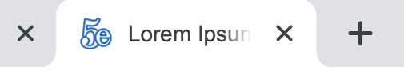
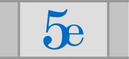
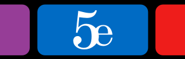

## Favicon update - 1.114.2 (probably)
Website favicons have been subtly redone by jpcranford (aka ldsmadman), based on the original logo by Fantom and Cyanomouss.

Here's a quick breakdown of what the new icons look like:

&nbsp;&nbsp;&nbsp;&nbsp;&nbsp;

*New favicon and preview*


*App icon*



*Safari Pinned Tab*



*MacBook Touch Bar Bookmark*

**Not pictured, but updated:** Android splash screen, Windows Start Menu tiles, standalone app mode

SVG designs were completed within Illustrator, and final sizes generated with Sketch. All source files have been included in a ZIP file [here](), with the changes detailed below for the curious. <!-- TODO insert link to zip file of source docs into link holder above -->

### Summary of Changes
- The text has been resized within the app logo to give more spacing around edge. (Apple's "official" app icon design grid came in handy here.) Also, a *slight* gradient was applied to give it some nearly-imperceptible pop.
- The icon with the pirate hat has been replaced. It was cheeky, but definitely not the impression we want to give off. <!-- TODO: Delete the /icon folder, wherever it is, since it's not used anymore -->
- Favicon: The stroke color has been changed to match the app icon. This has the added benefit of making it easier to see while in dark mode.
- **Better standalone mode:** After adding 5eTools to your mobile device's home screen, it now behaves like its own app, including showing up in your app switcher as "5eTools." (It did this before, but now it should behave a little better.) Depending on your platform, it may even show a back/forward button. Incidentally, this means it technically supports Multitasking on the iPad. Time to splitscreen your notes and the monster's stat block!
- **Android splash screen:** When launching it from the home screen, 5eTools now gets a fancy splash screen.

### New Icons
<!-- REVIEW: Remove task marks (last column of table) before final commit and pull request -->
<!-- TODO: Test all icons, on all platforms -->

#### New Files
<!-- TODO: Precomposed (circular?) app logo design -->
<!-- | multiple | favicon | The (in)famous `favicon.ico`. Very few, if any, browsers still use this. | ☐ | -->
| Resolution | Design | Device/Browser | Generated? | Tested? |
|-|-|-|-|-|
| SVG | favicon | Chrome, Firefox, and all Chromium browsers. Smaller filesize, and specified as preference over the PNG versions. | ☑︎ | ☑︎ |
| 16x16 | favicon | Only used on Firefox nowadays. Most browsers use the 32px version. | ☑︎ | ☑︎ |
| 32x32 | favicon | Most frequently used size for tab and bookmark icons, and also search results. | ☑︎ | ☑︎ |
| 48x48 | favicon | ??? | ☐ | ☐ |
| 120x120 | app icon | Apple Touch Icon for iPhones with @2x displays (iPhone SE/6s/7/8/XR) | ☑︎ | ☑︎ |
| 128x128 | white logo | Windows 10 Start Menu tile, Small size (`browserconfig.xml` for declaration, and `msapplication-TileColor` in HTML for background color) | ☑︎ | ☐ |
| 152x152 | app icon | Apple Touch Icon for iPads & iPad minis | ☑︎ | ☑︎ |
| 167x167 | app icon | Apple Touch Icon for iPad Pros | ☑︎ | ☐ |
| 180x180 | app icon | Apple Touch Icon for iPhones with @3x displays (iPhone 6s Plus/7 Plus/8 Plus/X/XS/XS Max). Also used by desktop Firefox and Safari for their bookmark and "desktop" icons | ☑︎ | ☐ |
| 192x192 | favicon | Desktop Chrome's Add to Desktop icon | ☑︎ | ☑︎ |
| 192x192 | app icon | Android Chrome's Add to Homescreen (see `manifest.webmanifest`) | ☑︎ | ☑︎ |
| 270x270 | white logo | Windows 10 Start Menu tile, Medium size (`browserconfig.xml` for declaration, and `msapplication-TileColor` in HTML for background color) | ☑︎ | ☐ |
| 512x512 | app icon | Android Chrome's splash screen (see `manifest.webmanifest`) | ☑︎ | ☑︎ |
| 558x270 | white logo | Windows 10 Start Menu tile, Wide size (`browserconfig.xml` for declaration, and `msapplication-TileColor` in HTML for background color) | ☑︎ | ☐ |
| 558x558 | white logo | Windows 10 Start Menu tile, Large size (`browserconfig.xml` for declaration, and `msapplication-TileColor` in HTML for background color) | ☑︎ | ☐ |
| 1024x1024 | app icon | Chrome web app mode (see `manifest.webmanifest`) | ☑︎ | ☑︎ |
| SVG | black logo | macOS Safari Pinned Tab and Touch Bar bookmark | ☑︎ | ☑︎ |

#### Testing Results
All tests were done off a locally downloaded (and obviously modified) fork, running Apache Web Server 2.4.41 (included with macOS Catalina) which was symlink'd into the clone directory.

#### New HTML code
This is the code that should now be in every page's `<head>` section. Just in case, I've duplicated it here.
<!-- TODO: Replace the version references with correct version as this favicon project gets closer to release. -->

```html
<!-- Favicons -->
<link rel="icon" type="image/svg+xml" href="favicon.svg?v=1.115">
<link rel="icon" type="image/png" sizes="256x256" href="favicon-256x256.png?v=1.114.2">
<link rel="icon" type="image/png" sizes="144x144" href="favicon-144x144.png?v=1.114.2">
<link rel="icon" type="image/png" sizes="128x128" href="favicon-128x128.png?v=1.114.2">
<link rel="icon" type="image/png" sizes="64x64" href="favicon-64x64.png?v=1.114.2">
<link rel="icon" type="image/png" sizes="48x48" href="favicon-48x48.png?v=1.114.2">
<link rel="icon" type="image/png" sizes="32x32" href="favicon-32x32.png?v=1.114.2">
<link rel="icon" type="image/png" sizes="16x16" href="favicon-16x16.png?v=1.114.2">

<!-- Chrome Web App Icons -->
<link rel="manifest" href="manifest.webmanifest?v=1.114.2">
<meta name="application-name" content="5eTools">
<meta name="theme-color" content="#006bc4">

<!-- Windows Start Menu tiles -->
<meta name="msapplication-config" content="browserconfig.xml?v=1.114.2" />
<meta name="msapplication-TileColor" content="#006bc4">

<!-- Apple Touch Icons -->
<link rel="apple-touch-icon" sizes="180x180" href="apple-touch-icon-180x180.png?v=1.114.2">
<link rel="apple-touch-icon" sizes="360x360" href="apple-touch-icon-360x360.png?v=1.114.2">
<link rel="apple-touch-icon" sizes="167x167" href="apple-touch-icon-167x167.png?v=1.114.2">
<link rel="apple-touch-icon" sizes="152x152" href="apple-touch-icon-152x152.png?v=1.114.2">
<link rel="apple-touch-icon" sizes="120x120" href="apple-touch-icon-120x120.png?v=1.114.2">
<meta name="apple-mobile-web-app-title" content="5eTools">

<!-- macOS Safari Pinned Tab and Touch Bar -->
<link rel="mask-icon" href="safari-pinned-tab.svg?v=1.114.2" color="#006bc4">

<!-- TODO Coast by Opera icon (228x228) -->
<!-- <link rel="icon" href="$URL" sizes="228x228"> -->
```
<!--  -->

### Warning: Don't use a favicon.ico!
ICO is a dated format, and nearly all browsers within use today support PNG favicons, according to [Can I Use…?](caniuse.com). In fact, some modern browsers will always prefer the ICO, even if there are better PNG options available.

### Designs & Resolutions
(table)

It should be noted that several browsers on both desktop and mobile platforms use the Apple Touch Icon for various functions. For specifics, see [this page](https://realfavicongenerator.net/favicon_compatibility) put together by the RealFaviconGenerator.

### Update to Repo
#### Files
| Complete? | Filename | Dimensions | Resolution (if >1x) | Usage |
|-|-|-|-|-|
| ☑︎ | `favicon-16x16.png` | 16px × 16px |  | Used in everything from lists of bookmarks to the tab icons. |
| ☑︎ | `favicon-32x32.png` | 32px × 32px | @2x | Same as above, but adjusted for high-density displays. AFAIK, this is currently only implemented in Safari on macOS. Shame. |
| ☑︎ | `favicon-96x96.png` | 96px × 96px |  | GoogleTV icon |
| ☑︎ | `favicon-128x128.png` | 128px × 128px |  | ??? |
| ☑︎ | `favicon-196x196.png` | 196px × 196px |  | ??? |
|  | `apple-touch-icon-57x57.png` |  |  | *No longer listed as current on Apple's website.* |
|  | `apple-touch-icon-60x60.png` |  |  | *No longer listed as current on Apple's website.* |
|  | `apple-touch-icon-72x72.png` |  |  | *No longer listed as current on Apple's website.* |
|  | `apple-touch-icon-76x76.png` |  |  | *No longer listed as current on Apple's website.* |
|  | `apple-touch-icon-114x114.png` |  |  | *No longer listed as current on Apple's website.* |
| ☐ | `apple-touch-icon-120x120.png` | 120px × 120px | @2x | Non-"Plus" iPhones (up to 8), iPhone XR, all iPads |
| ☐ | `apple-touch-icon-152x152.png` | 152px × 152px | @2x | iPad, iPad mini |
| ☐ | `apple-touch-icon-167x167.png` | 167px × 167px | @3x | iPad Pro |
| ☐ | `apple-touch-icon-180x180.png` | 180px × 180px | @3x | All "Plus"-model iPhones, iPhone X/XS/XS Max. |
|  | `apple-touch-icon-1024x1024.png` |  |  | Fallback for Apple devices. If the device's preferred size isn't found, it'll use the next size up. This one pretty much future-proofs it. |
|  | `android-chrome-192x192.png` |  |  |  |
|  | `android-chrome-256x256.png` |  |  |  |
|  | `android-chrome-512x512.png` |  |  |  |
|  | `site.webmanifest` |  |  | Neat little JSON file to let Android Chrome know which icons to use. |
|  | (Safari pinned tab) |  |  |  |
| ☐ | `mstile-70x70.png` | 128px × 128px |  | Windows 10 Start Menu tile, small size. <!-- COMBAK: Test these as PNG, use alternative if needed to keep file size under spec. --> |
| ☐ | `mstile-150x150.png` | 270px × 270px |  | Windows 10 Start Menu tile, medium size. |
|  | `mstile-310x150.png` | 270px × 270px |  | Windows 10 Start Menu tile, wide size. |
|  | `mstile-310x310.png` | 558px × 558px |  | Windows 10 Start Menu tile, large size. |
| ☑︎ |  |  |  |  |

# (WIP stuff)
[^2]: Official documentation for the Apple icons is located [here](https://developer.apple.com/library/archive/documentation/AppleApplications/Reference/SafariWebContent/ConfiguringWebApplications/ConfiguringWebApplications.html#//apple_ref/doc/uid/TP40002051-CH3-SW6), and their style guidelines and recommendations for app icons can be found [here](https://developer.apple.com/design/human-interface-guidelines/ios/icons-and-images/app-icon/).

[^3]: Documentation for Safari's "pinned tab" icons (which are how Touch Bar bookmarks do their thing) is [here](https://developer.apple.com/library/archive/documentation/AppleApplications/Reference/SafariWebContent/pinnedTabs/pinnedTabs.html#//apple_ref/doc/uid/TP40002051-CH18-SW1)

[^4]: **Note: These "must be smaller than 200 KB in size and no larger than 1024x1024 pixels."** Documentation for Microsoft Edge/Windows 10's "Pinned Sites" feature can be found on Microsoft's website, including a task-based [walkthrough](https://docs.microsoft.com/en-us/previous-versions/windows/internet-explorer/ie-developer/dev-guides/bg183312%28v=vs.85%29?redirectedfrom=MSDN), [style recommendations](http://msdn.microsoft.com/en-us/library/ie/dn455106%28v=vs.85%29.aspx), and a [metadata reference](https://docs.microsoft.com/en-us/previous-versions/windows/internet-explorer/ie-developer/platform-apis/dn255024%28v=vs.85%29). If you didn't know that you could pin websites to Start Menu tiles, check out [this primer](https://www.lifewire.com/pin-web-page-to-windows-10-start-menu-4103663) to get started.

### Upgraded
- Apple's touch icon [documentation](https://developer.apple.com/library/archive/documentation/AppleApplications/Reference/SafariWebContent/ConfiguringWebApplications/ConfiguringWebApplications.html#//apple_ref/doc/uid/TP40002051-CH3-SW6) was followed to the letter, and their app icon style [guidelines](https://developer.apple.com/design/human-interface-guidelines/ios/icons-and-images/app-icon/) were also consulted.
- The [FAQ page](https://realfavicongenerator.net/faq) over at RealFaviconGenerator.net was very helpful in locating the source documentation for so many of these browsers and operating systems.

